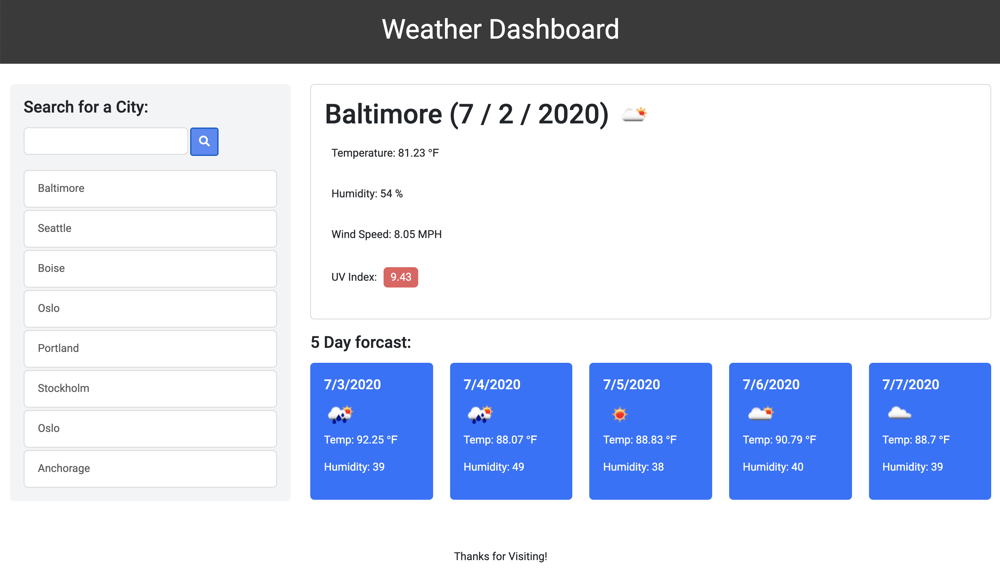

# Weather-Dashboard

A simple weather dashboard that allows the user to see the weather outlook for mutliple cities and plan their trip accordingly, made using the Open Weather API.

The interface has a default location set to Baltimore, the city in which the application was created. 

The interface is comprised of 3 parts: 

1. Current weather information including todays date, an icon indicating expected weather conditions, temperature, humidity, wind speed, and UV index. The current UV index is color-coordinated to indicate if sun protection is needed: 

   - If the index is below 3, it is green, indicating no protection is needed.
   - If the index is betweeen 3 and 7, it is yellow, indicating some protection is needed. 
   - If the index is above 7, it is red, indicating extra protection is needed. 

2. A future weather forcast for the next 5 days, including each day's date, an icon that indicating expected weather conditions, temperature, and humidity.

3. A list of the last 8 recently searched cities.

When the user searches for a new city, that city's information is displayed. 
When the user clicks on one of the recently searched cities, the information for the clicked city is displayed. 
This allows the user to quickly compare weather conditions from multiple cities when planning a trip. 

Upon re-opening the application, the most recent searched city's information is displayed, and all recent searches remain available. 

Preview it here: https://kimcredit.github.io/Weather-Dashboard/
